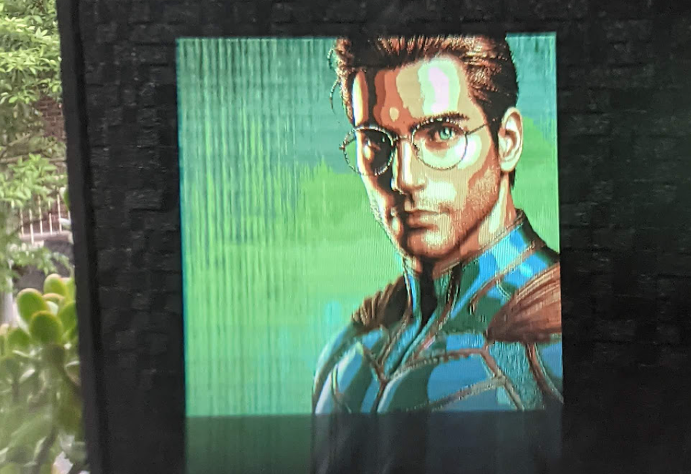
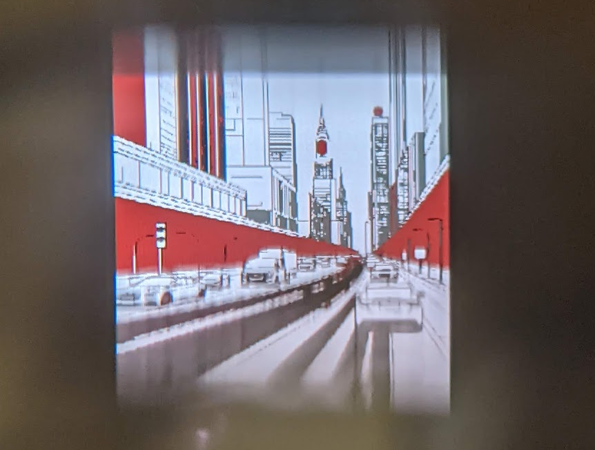
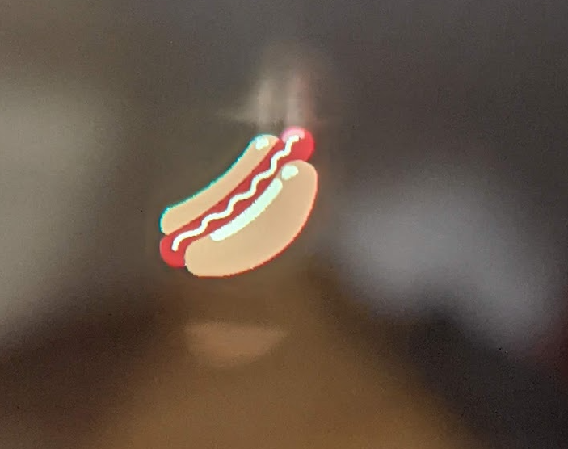

# Frame Progressive Sprite Viewer

Basic image and sprite viewer for Brilliant Labs Frame.

Demonstrates `TxImageSpriteBlock` that splits the image into slices and sends smaller sprite lines, optionally allowing for progressive/incremental rendering and potentially a smaller peak memory requirement during packet assembly.

## Frameshots

JPG quantized and scaled to 4-bit sprite - custom palette

1-bit sprite - default palette

2-bit sprite - default palette

4-bit sprite - default palette

## Instructions

* Connect to Frame and start the application. Using the file picker, choose any PNG or JPG file from your device.
* 1-bit, 2-bit or 4-bit indexed (palette) PNG files can be transferred directly. Sample sprites of each type are included in the assets/ directory, which you can download to your device.
* General PNG and JPG images (e.g. photos from your camera) will be quantized to 16 colors and scaled to fit.
* Images can use the [Frame default palette](assets/palette-frame.aseprite) to be displayed with correct colors alongside other Frame content, but if the palette is different (e.g. from a quantized image) it will be set on Frame for rendering, and will affect any subsequent draw calls for text or images.
* Tools such as [LibreSprite](https://libresprite.github.io/) are useful for creating 1-, 2- and 4-bit images in specific palettes.